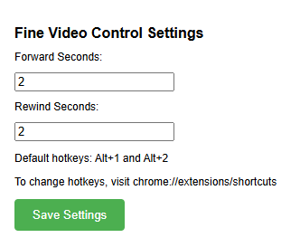

This browser extension finds the video player with ```document.querySelector('video')``` and moves its ```currentTime``` by a custom amount.

Default hokeys are Alt+1 and Alt+2. Those can be changed using the built in extensions hotkeys manager.


